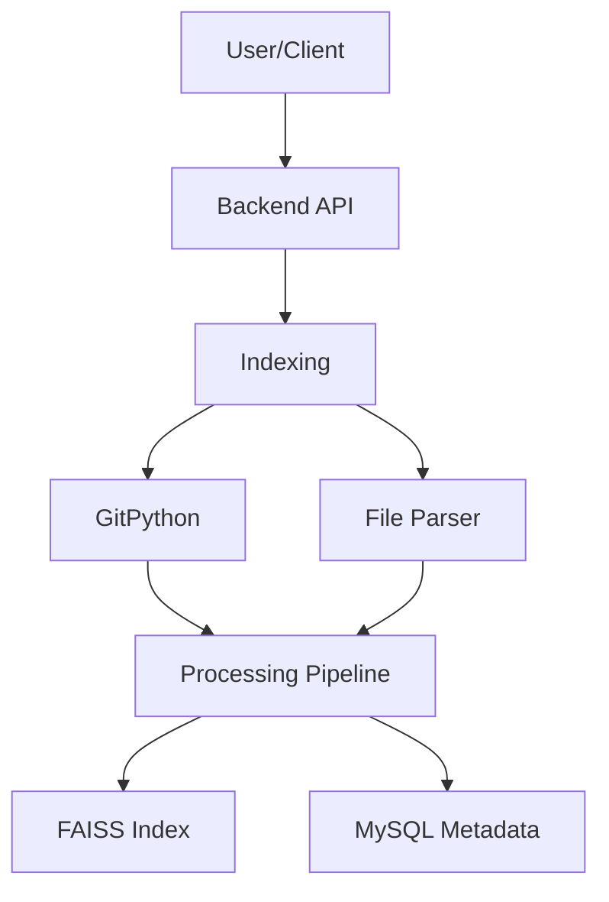

# Git Sage Workflow Documentation

## 1️⃣ Indexing Workflow

### 🩵 Step 1 — Input
**Component**: Web UI / n8n webhook / API endpoint
- **Action**: User submits repo URL
- **Example**:
```http
POST /analyze_repo
{
    "repo_url": "https://github.com/user/project"
}
```

### ⚙️ Step 2 — Clone Repository
**Component**: GitPython
- **Action**: Clone repo locally into workspace folder
- **Output**: Local repo files on disk

### 📁 Step 3 — File Parsing
**Component**: Python script
- **Action**: Traverse directories and filter files
  - Skip `.git/`, binaries, and large media files
  - Collect `.py`, `.js`, `.md`, `.json`, etc.
- **Output**: List of files + content + metadata

### ✂️ Step 4 — Chunking
**Component**: LangChain's RecursiveCharacterTextSplitter
- **Action**: Break files into smaller chunks (800-1,000 tokens)
- **Output**: Text chunks with metadata

### 🧬 Step 5 — Embedding Generation
**Component**: OpenAI / Hugging Face Embedding API
- **Action**: Convert text chunks to vector embeddings
- **Output**: `(chunk_id, vector, metadata)`

### 💾 Step 6 — Store in FAISS
**Component**: FAISS index (HNSW or IVF Flat)
- **Action**: Add vectors to FAISS index
- **Output**: Searchable vector memory

### 🗃️ Step 7 — Store Metadata in MySQL
**Component**: MySQL
- **Action**: Insert record in database

| Field | Example |
|-------|---------|
| repo_name | "requests" |
| repo_url | "https://github.com/psf/requests" |
| index_path | "/data/requests.index" |
| total_files | 124 |
| total_chunks | 960 |
| analyzed_at | timestamp |

### ✅ Step 8 — Confirm Completion
**Component**: API response
- **Output**:
```json
{
    "status": "indexed",
    "repo_id": 12
}
```

## 2️⃣ Query Workflow

### 💡 Step 1 — User Question
**Component**: Web UI / CLI / API
- **Example**: "How does this repo handle database connections?"

### ⚙️ Step 2-5 — Processing
1. Fetch repo context
2. Embed question
3. Semantic search (FAISS)
4. Context assembly

### 🤖 Step 6 — LLM Integration
**Component**: OpenAI GPT API
- **Action**: Send context + question
- **Output**: Natural language explanation

### 🧭 Step 7-10 — Output Processing
1. Post-process & summarize
2. Generate visualizations
3. Store query log
4. Return to user

## System Architecture



## ⚡ Data Movement

| Step | From | To | Data Type |
|------|------|-----|-----------|
| 1 | User | Backend | JSON |
| 2 | Backend | GitPython | URL string |
| 3 | GitPython | Disk | Repo files |
| 4 | Files | Text Splitter | Plain text |
| 5 | Text | Embedding Model | Vector array |

## 🧠 Optimization Tips

- Cache embeddings in Redis
- Use batch embedding
- Compress FAISS index
- Add auto-suggested questions